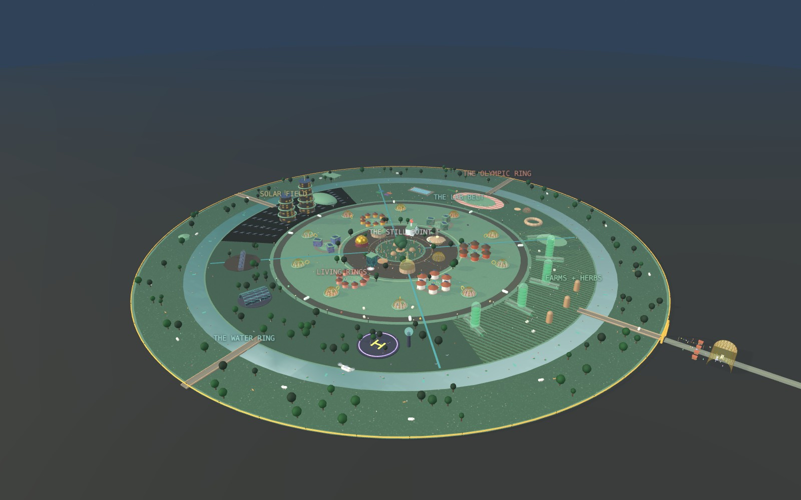

# SŪRYA NAGARI — The World's First Living Model

A 200-acre "living-model" AI township in India, presented as an interactive website:
farming, solar, health, sport, governance and silence running as one continuously-trained
model — owned by its people, transparent, and open source.

**Live:** https://anmolsam.github.io/surya-nagari/



## Contents
- **index.html** — the landing page
- **prospectus.html** — the full detailed living-model document
- **township-3d.html** — the interactive 3D township (Three.js); drag to orbit, day/night, fly-to zones
- **founding-charter.html** — the ten-article charter
- **brochure.html** → **Surya-Nagari-Prospectus.pdf** — the shareable prospectus PDF
- **shots/** , **cover.jpeg** — 3D renders used across the site & PDF

## Run locally
```bash
python3 -m http.server 8742
# then open http://localhost:8742/
```
No build step. Static HTML/CSS/JS. Deployed via GitHub Pages (branch `main`, path `/`).

## For developers / Claude
See **CLAUDE.md** for the full handoff: file roles, the 3D model internals, how to regenerate
the PDF, deploy steps, and project conventions.

Designed by Anmol with Claude · 2026
