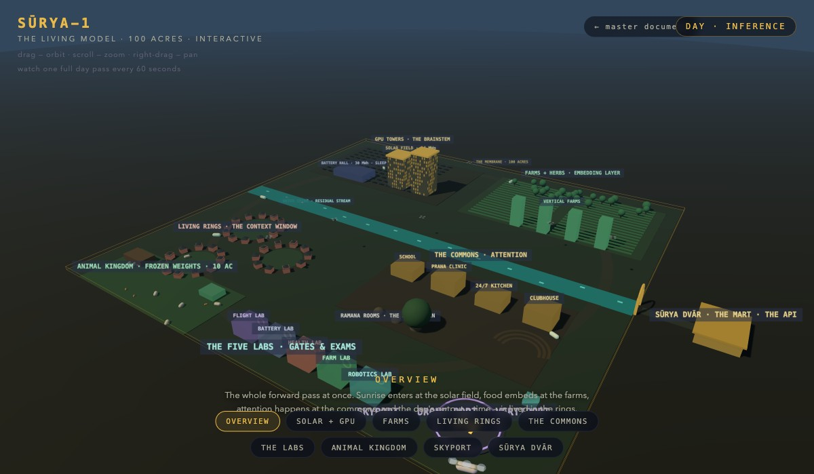

# SŪRYA-1 — The World's First Living Model

A 100-acre township designed as a physical foundation model: farming, solar, EV, flight, health and silence running as one continuously-trained system.

- **index.html** — the master document: model card + charter + bank term sheet
- **township-3d.html** — interactive 3D township (Three.js): drag to orbit, day/night cycle every 60s
- **founding-charter.html** — the ten-article founding charter
- **project-report.html** — the bank appraisal report (SN-PR-002)

Designed by Anmol with Claude · June 2026
